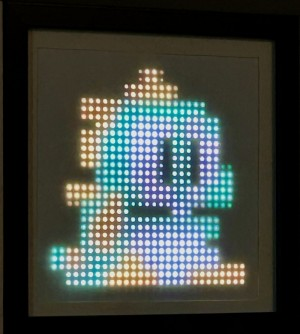
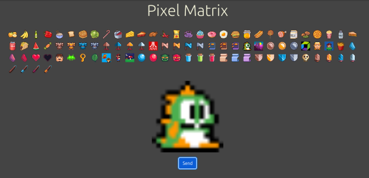

# LedMatrix2

This project is about an LED Pixel Matrix that can be controlled with a simple web application.

For **details** have a look at his [blog post](https://wolfgang-ziegler.com/blog/remote-controlled-led-matrix).

## Matrix

The 32x32 RGB LED Matrix is controlled by a **Raspberry Pi Pico W** using **CircuitPython**.

## MatrixClient

An **ASP.NET MVC** application controls the pixel art displayed on the matrix.

### TODOs

* **Grouping** or **tagging** the icons (e.g. `emoji`, `food`, ....).
* Image **upload** (and conversion) functionality. Currently, you have to manually add 32x32 images to the `wwwroot` folder.
* "**Auto-send**" mode in which the images are periodically and randomly sent to the matrix.
* An **editor** mode in which custom pixel artwork can be created.
* Dynamically generated images:
  * A **clock** (analog, digital, ...).
  * A **calendar**.
  * A **weather** widget.
  * Or a **stock ticker**.
* **Animations** would be awesome. This requires changes to the Python LED Matrix server as well, though.
