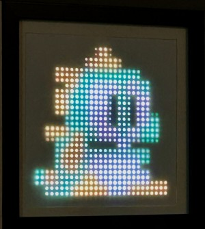
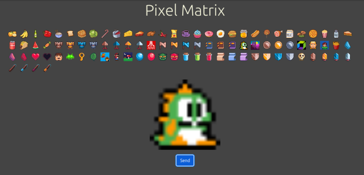

# LedMatrix2

A remote-controlled LED pixel matrix with a web-based control application.

For details have a look at the [blog post](https://wolfgang-ziegler.com/blog/remote-controlled-led-matrix).

## Hardware — Matrix

The 32×32 RGB LED Matrix is driven by a **Raspberry Pi Pico W** running **CircuitPython**. It exposes a simple HTTP server: a GET request fills the display with a random colour, a POST request accepts a 6,144-char hex string (one `RRGGBB` value per pixel) and renders it.

## Software — MatrixClient

An **ASP.NET Core MVC** (.NET 10) application running in Docker on a home Kubernetes cluster.

### Features

**Gallery** — browse and send any of the 32×32 PNG images organised into categories (`food`, `rpg`, `retro`, `other`).

**Draw** — paint directly on a 32×32 pixel canvas with draw, erase, and flood-fill tools, then send to the matrix instantly.

**Auto-send** — rule-based scheduler defined in `rules.yaml`. Each rule specifies days, a time window, a category (or dynamic mode), and an optional per-rule interval. Once enabled it runs until explicitly disabled.

**Dynamic modes** — server-rendered 32×32 images generated on demand:
- **Clock** — current time (HH:MM) using a hand-coded 5×3 bitmap font
- **Calendar** — weekday, day-of-month, and month abbreviation
- **Weather** — current temperature and a weather condition icon fetched from [Open-Meteo](https://open-meteo.com/) (no API key required); location configured in `appsettings.json`

**Schedule view** — weekly calendar showing which auto-send rules are active and when.
